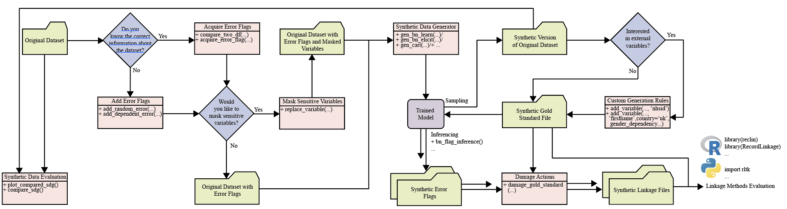

# Background

Linkage of administrative data sources is an efficient approach for conducting research on large populations, avoiding the time and cost of traditional data collection methods. Careful development of methods for linking data where unique identifiers are not available is key to avoiding bias resulting from linkage errors. However, the development and evaluation of new methods are limited by restricted access to identifier data for these purposes. Generating synthetic datasets of personal identifiers, which replicate the frequencies and errors of identifiers observed in administrative data, could facilitate the development of new methods. 

# Aim

We aimed to develop the sdglinkage package for generating synthetic dataset for linkage method development, with i) gold standard file with complete and accurate information and ii) linkage files that are corrupted as we often see in raw dataset.

# Workflow

The package has several main types of functions:

1. **Acquire Error Flags**, which extracts and classifies error from a real linkage file into binary flags. These flags allow us to learn the occurrence of errors and consequently, replicate the error in the synthetic linkage files. 
2. **Add Error Flags**, which allows us to add random or dependent errors to our real gold standard file in the case we do not have access to the corrupted files but have access to error statistics.
3. **Mask Sensitive Variables**, which replace sensitive variables with variables from another published database.
4. **Synthetic Data Generator**, which learns the statistics and dependencies of variables and sample synthetic data from the learned models.
5. **Synthetic Data Evaluation**, which compares the synthetic data with the real data and gives the visual comparison and predictive comparison of the quality of the synthetic data.
6. **Custom Generation Rules**, which allows us to generate synthetic variables that are not included in the real dataset. 
7. **Damage Actions**, which corrupt the dataset based on the types of errors occurred. 

These functions can be organised as:

---

 

---

# Vignette

We also provide three vignettes to show how we can use the package: 

* Vignette **Synthetic_Data_Generation_and_Evaluation** shows how to generate synthetic data and to evaluate the quality of the synthetic data. 
* Vignette **Generation_of_Gold_Standard_File_and_Linkage_Files** shows how to generate synthetic gold standard and linkage files when we have access to non-sensitive predictor variables.
* Vignette **From_Sensitive_Real_Identifiers_to_Synthetic_Identifiers** shows how to generate synthetic identifiers when we have access to sensitive identifiers.
